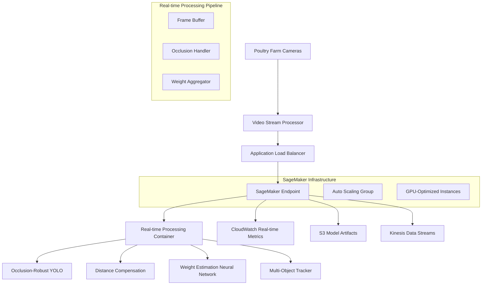
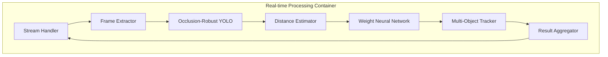

# Design Document

## Overview

The chicken weight estimation system will be deployed on AWS SageMaker as a real-time inference endpoint specifically designed for live poultry farm footage. The system combines YOLO object detection optimized for occlusion handling with neural network-based weight estimation that accounts for camera distance limitations and varying farm conditions. The deployment architecture follows SageMaker's bring-your-own-container (BYOC) pattern using a custom Docker container optimized for real-time video stream processing.

The system is designed to handle continuous video streams from poultry farm cameras, providing real-time detection and weight estimation with an acceptable error tolerance of ±20-30%. The architecture emphasizes low-latency processing, occlusion-robust detection, distance-adaptive weight estimation, and scalability for multiple farm locations.

## Architecture

### High-Level Architecture



### Container Architecture



## Components and Interfaces

### 1. SageMaker Endpoint Configuration

**Purpose**: Manages the deployment and scaling of the inference endpoint

**Key Components**:
- Endpoint Configuration with instance type and scaling policies
- Model artifact location in S3
- Container image URI in ECR
- Environment variables for model configuration

**Interface**:
```python
endpoint_config = {
    "EndpointConfigName": "chicken-weight-estimator-config",
    "ProductionVariants": [{
        "VariantName": "primary",
        "ModelName": "chicken-weight-model",
        "InitialInstanceCount": 1,
        "InstanceType": "ml.g4dn.xlarge",
        "InitialVariantWeight": 1.0
    }]
}
```

### 2. Custom Docker Container

**Purpose**: Packages all model dependencies and inference logic

**Key Components**:
- Base image with PyTorch, OpenCV, and Ultralytics
- YOLO model weights and configuration
- Weight estimation neural network models
- Flask web server for handling requests
- Health check endpoints

**Dockerfile Structure**:
```dockerfile
FROM pytorch/pytorch:2.0.1-cuda11.7-cudnn8-runtime
# Install dependencies
# Copy model artifacts
# Copy inference code
# Set up Flask server
# Configure health checks
```

### 3. Inference Handler

**Purpose**: Orchestrates the detection and weight estimation pipeline

**Key Methods**:
- `preprocess_image()`: Image validation, resizing, normalization
- `detect_chickens()`: YOLO inference for chicken detection
- `estimate_weights()`: Ensemble weight estimation
- `postprocess_results()`: Format response JSON

**Interface**:
```python
class ChickenWeightInferenceHandler:
    def predict(self, input_data: Dict) -> Dict
    def health_check(self) -> Dict
    def model_metadata(self) -> Dict
```

### 4. Occlusion-Robust YOLO Detection Module

**Purpose**: Detects chickens in live footage with heavy occlusions and varying distances

**Key Components**:
- Enhanced YOLO model with occlusion handling (YOLOv11 with attention mechanisms)
- Multi-scale detection for varying camera distances
- Partial visibility detection (minimum 30% visibility threshold)
- Temporal consistency across video frames
- Confidence-based filtering with dynamic thresholds

**Interface**:
```python
class OcclusionRobustYOLODetector:
    def __init__(self, model_path: str, min_visibility: float = 0.3)
    def detect_with_occlusion_handling(self, frame: np.ndarray, previous_detections: List[Detection]) -> List[Detection]
    def estimate_occlusion_level(self, detection: Detection) -> float
    def apply_temporal_smoothing(self, current_detections: List[Detection], history: List[List[Detection]]) -> List[Detection]
```

### 5. Distance-Adaptive Weight Neural Network

**Purpose**: Estimates chicken weights using neural network optimized for real poultry conditions

**Key Components**:
- Deep neural network trained on distance-compensated features
- Camera calibration and distance estimation module
- Occlusion-aware feature extraction
- Age-based weight range validation
- Confidence scoring with ±20-30% error tolerance

**Interface**:
```python
class DistanceAdaptiveWeightNN:
    def __init__(self, model_path: str, camera_params: CameraParameters)
    def estimate_weight_with_distance(self, frame: np.ndarray, bbox: List[float], distance: float, occlusion_level: float) -> WeightEstimate
    def extract_distance_compensated_features(self, frame: np.ndarray, bbox: List[float], distance: float) -> np.ndarray
    def validate_weight_range(self, weight: float, estimated_age: str) -> bool
```

### 6. Multi-Object Tracking Module

**Purpose**: Maintains chicken identity across frames to improve weight estimation accuracy

**Key Components**:
- DeepSORT-based tracking algorithm
- Chicken re-identification features
- Temporal weight smoothing
- Occlusion-aware tracking state management

**Interface**:
```python
class ChickenTracker:
    def __init__(self, max_disappeared: int = 30, max_distance: float = 100)
    def update_tracks(self, detections: List[Detection], weights: List[WeightEstimate]) -> List[TrackedChicken]
    def get_stable_weight_estimates(self, chicken_id: str, window_size: int = 10) -> WeightEstimate
    def handle_occlusion_tracking(self, tracks: List[TrackedChicken]) -> List[TrackedChicken]
```

### 7. Distance Compensation Module

**Purpose**: Adjusts weight estimates based on camera distance and perspective

**Key Components**:
- Camera calibration parameters
- Perspective distortion correction
- Distance-based feature scaling
- Multi-camera fusion support

**Interface**:
```python
class DistanceCompensator:
    def __init__(self, camera_params: CameraParameters)
    def estimate_distance_to_chicken(self, bbox: List[float], frame_shape: Tuple[int, int]) -> float
    def compensate_features_for_distance(self, features: np.ndarray, distance: float) -> np.ndarray
    def validate_distance_estimate(self, distance: float, bbox_size: float) -> bool
```

### 8. Request/Response Schema

**Real-time Stream Request Schema**:
```json
{
    "stream_data": {
        "frame": "base64_encoded_frame_data",
        "timestamp": "2024-01-15T10:30:00.123Z",
        "camera_id": "farm_camera_01",
        "frame_sequence": 12345,
        "parameters": {
            "min_confidence": 0.4,
            "max_occlusion": 0.7,
            "weight_tolerance": 0.25
        }
    }
}
```

**Real-time Response Schema**:
```json
{
    "frame_results": {
        "camera_id": "farm_camera_01",
        "timestamp": "2024-01-15T10:30:00.123Z",
        "frame_sequence": 12345,
        "detections": [
            {
                "chicken_id": "tracked_chicken_001",
                "bbox": [x1, y1, x2, y2],
                "confidence": 0.85,
                "occlusion_level": 0.3,
                "distance_estimate": 2.5,
                "weight_estimate": {
                    "value": 2.1,
                    "unit": "kg",
                    "confidence": 0.78,
                    "error_range": "±0.5kg",
                    "method": "distance_adaptive_nn"
                },
                "age_category": "WEEK_4",
                "tracking_status": "stable"
            }
        ],
        "processing_time_ms": 45,
        "total_chickens_detected": 12,
        "average_weight": 2.3,
        "status": "success"
    }
}
```

## Data Models

### Detection Class
```python
@dataclass
class Detection:
    bbox: List[float]  # [x1, y1, x2, y2]
    confidence: float
    class_id: int
    class_name: str
```

### WeightEstimate Class
```python
@dataclass
class WeightEstimate:
    value: float
    unit: str
    confidence: float
    error_range: str  # e.g., "±0.5kg"
    distance_compensated: bool
    occlusion_adjusted: bool
    age_category: Optional[str]
    method: str  # "distance_adaptive_nn"
```

### RealTimeInferenceResult Class
```python
@dataclass
class RealTimeInferenceResult:
    camera_id: str
    timestamp: datetime
    frame_sequence: int
    detections: List[Detection]
    weight_estimates: List[WeightEstimate]
    processing_time_ms: float
    total_chickens_detected: int
    average_weight: float
    tracking_continuity: float
    status: str
    error_message: Optional[str]
```

## Error Handling

### Error Categories

1. **Input Validation Errors**
   - Invalid image format or size
   - Missing required parameters
   - Malformed request structure

2. **Model Inference Errors**
   - YOLO model loading failures
   - Weight estimation model errors
   - GPU memory issues

3. **System Errors**
   - Container resource exhaustion
   - Network connectivity issues
   - S3 model artifact access failures

### Error Response Format
```json
{
    "error": {
        "code": "INVALID_INPUT",
        "message": "Image format not supported",
        "details": {
            "supported_formats": ["JPEG", "PNG"],
            "received_format": "GIF"
        }
    },
    "request_id": "uuid",
    "timestamp": "2024-01-15T10:30:00Z"
}
```

### Error Handling Strategy

1. **Graceful Degradation**: If weight estimation fails, return detection results only
2. **Retry Logic**: Implement exponential backoff for transient failures
3. **Circuit Breaker**: Prevent cascade failures in ensemble methods
4. **Logging**: Comprehensive error logging with context for debugging

## Testing Strategy

### Unit Testing

1. **Model Loading Tests**
   - Verify YOLO model loads correctly
   - Test weight estimation model initialization
   - Validate feature extraction functions

2. **Inference Pipeline Tests**
   - Test image preprocessing with various formats
   - Validate detection accuracy with known test images
   - Test weight estimation with synthetic data

3. **Error Handling Tests**
   - Test invalid input handling
   - Verify error response formats
   - Test resource exhaustion scenarios

### Integration Testing

1. **End-to-End Pipeline Tests**
   - Test complete inference pipeline with real images
   - Validate response format and timing
   - Test batch processing functionality

2. **SageMaker Integration Tests**
   - Test container deployment on SageMaker
   - Validate endpoint health checks
   - Test auto-scaling behavior

3. **Performance Tests**
   - Load testing with concurrent requests
   - Memory usage profiling
   - GPU utilization monitoring

### Acceptance Testing

1. **Real-time Performance Validation**
   - Validate processing latency under 100ms per frame
   - Test weight estimation accuracy within ±20-30% tolerance
   - Verify detection performance with 50-70% occlusion levels

2. **Live Farm Conditions Testing**
   - Test with varying lighting conditions (dawn, daylight, artificial lighting)
   - Validate performance with different camera distances (2-10 meters)
   - Test with different chicken densities and movement patterns

3. **Tracking and Continuity Tests**
   - Verify chicken tracking across occlusions
   - Test weight estimate stability over time
   - Validate re-identification after temporary disappearance

### Test Data Requirements

1. **Live Poultry Farm Video Dataset**
   - Continuous video streams from multiple camera angles
   - Various chicken ages and densities
   - Different lighting conditions throughout the day
   - Ground truth weights measured at regular intervals
   - Occlusion scenarios (50-70% visibility)

2. **Distance and Perspective Test Cases**
   - Camera heights from 2-4 meters
   - Viewing distances from 2-10 meters
   - Different camera angles (overhead, side-mounted)
   - Perspective distortion scenarios

3. **Real-time Performance Benchmarks**
   - Frame processing latency targets (<100ms)
   - Weight estimation accuracy within ±20-30%
   - Tracking continuity across occlusions
   - Memory usage under continuous processing
   - GPU utilization patterns for real-time inference